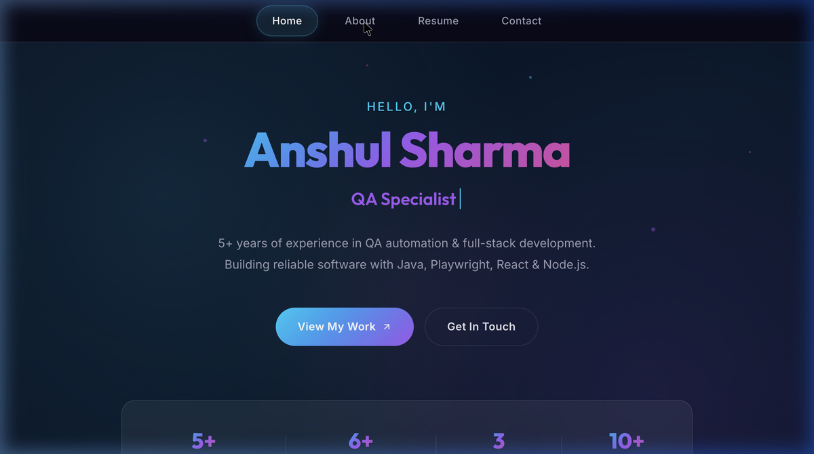
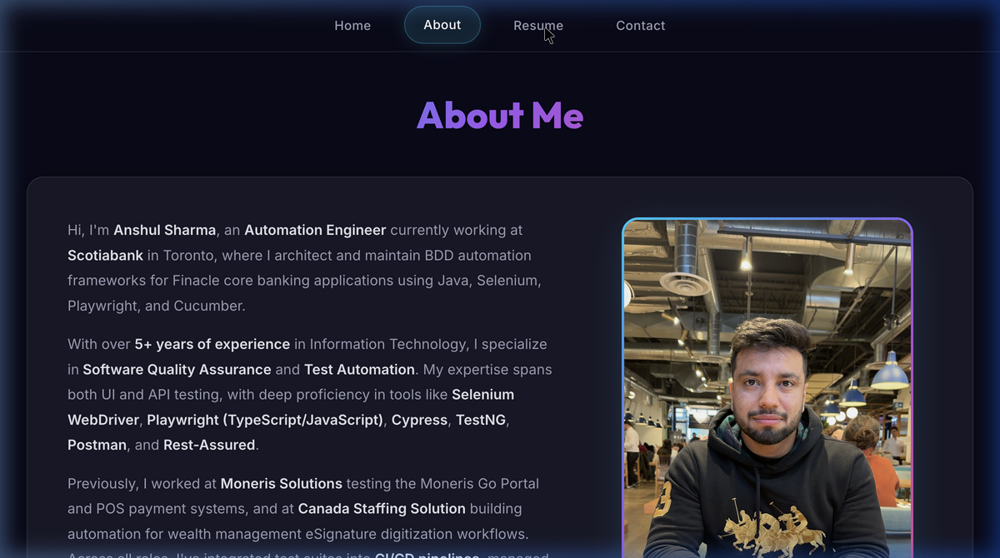
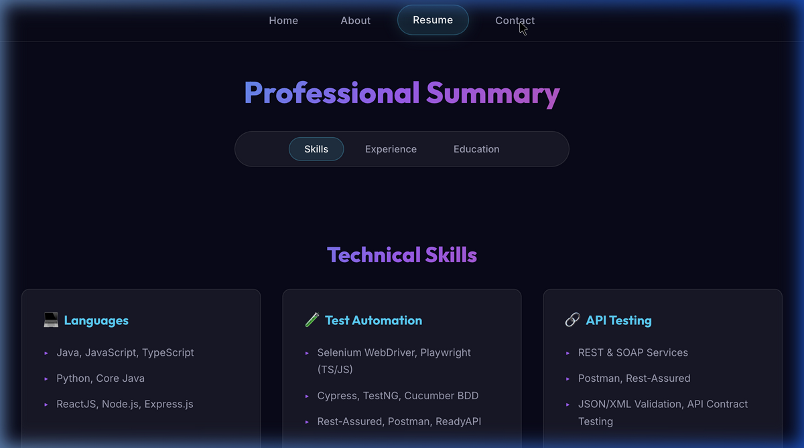

# Anshul Sharma — Portfolio

A modern, dark-themed personal portfolio built with **React + Vite**, featuring glassmorphism UI, micro-animations, and a dynamic hero section with typing effects.

## 🖼️ Screenshots

### Home


### About


### Resume


## ✨ Features

### 🏠 Dynamic Landing Page
- **Typing animation** cycling through roles (Automation Engineer, Full-Stack Developer, QA Specialist)
- **Floating particles** with animated gradient background
- **Call-to-action buttons** — "View My Work" and "Get In Touch"
- **Stats bar** — Years of experience, projects built, companies, and tech skills

### 👤 About Me
- Professional bio highlighting current role at **Scotiabank** and previous experience
- Profile image with gradient border and hover effects
- Glassmorphism card layout

### 📄 Resume
- **Section navigation** — Jump between Skills, Experience, and Education
- **8 technical skill categories** — Languages, Test Automation, API Testing, Frameworks, CI/CD, Databases, and more
- **Work Experience** — Scotiabank (current), Moneris Solutions, Canada Staffing Solution with detailed bullet points
- **Education** — University of Toronto, Lambton College

### 📬 Contact
- Contact form with glowing focus states
- Gradient submit button with hover animations
- Social links in the footer (LinkedIn, GitHub)

### 🎨 Design System
- **Color palette**: Deep navy base (`#0a0a1a`) with cyan-to-purple gradient accents
- **Typography**: Inter (body) + Outfit (headings) from Google Fonts
- **Glassmorphism**: Translucent cards with backdrop blur throughout
- **Animations**: Fade-in-up stagger, hover lifts, glow effects, particle floats

## 🛠️ Technologies Used

| Category | Technologies |
|----------|-------------|
| **Framework** | React 18, React Router v6 |
| **Build Tool** | Vite |
| **Styling** | Vanilla CSS with CSS Custom Properties |
| **Fonts** | Google Fonts (Inter, Outfit) |
| **Deployment** | Netlify |

## 🚀 Getting Started

### Prerequisites
- Node.js 18+ and npm

### Installation

```bash
# Clone the repository
git clone https://github.com/Anshul1555/Portfolio.git
cd Portfolio

# Install dependencies
npm install

# Start development server
npm run dev
```

The app runs at `http://localhost:3000/`

### Production Build

```bash
npm run build
```

Static files are generated in the `dist/` directory.

## 📁 Project Structure

```
Portfolio/
├── public/               # Static assets (images, profile pic)
├── src/
│   ├── components/       # Reusable components (NavTabs)
│   ├── css/              # Modular stylesheets
│   │   ├── Body.css      # Design system & hero section
│   │   ├── NavTabs.css   # Navigation styles
│   │   ├── About.css     # About page styles
│   │   ├── Projects.css  # Project cards styles
│   │   ├── Contact.css   # Contact form styles
│   │   └── Resume.css    # Resume page styles
│   ├── pages/            # Page components
│   │   ├── Home.jsx      # Dynamic landing page
│   │   ├── About.jsx     # About me section
│   │   ├── Resume.jsx    # Skills, experience, education
│   │   ├── Contact.jsx   # Contact form
│   │   ├── Projects.jsx  # Project showcase
│   │   └── Footer.jsx    # Footer with social links
│   ├── App.jsx           # Root layout component
│   └── main.jsx          # Entry point & routing
├── index.html            # HTML template with SEO meta tags
└── vite.config.js        # Vite configuration
```

## 🌐 Deployed Application

Live at: **[anshul-sharma-fullstack.netlify.app](https://anshul-sharma-fullstack.netlify.app/)**

## 📝 License

This project is open source and available for personal use.
